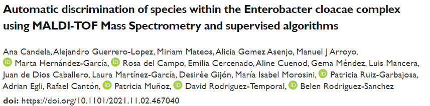

Who I am 
------
Currently, I am a Ph.D. student in Machine Learning for Personalized Medicine at Universidad Carlos III de Madrid (UC3M) under the supervision of [Dr. Pablo M. Olmos](http://www.tsc.uc3m.es/~olmos/) and [Dr. Vanessa Gómez Verdejo](https://vanessa.webs.tsc.uc3m.es). I am also working with [Gregorio Marañón Health Research Institute (IISGM)](https://www.iisgm.com) under the supervision of [Dr. Belén Rodríguez-Sánchez](https://scholar.google.es/citations?user=W9sZbBoAAAAJ&hl=es). 

My work is focused on the development of probabilistic ML models and applying them to biomedical real problems such as the prediction of Antibiotic Resistance mechanisms in different microorganisms. We focus our research on heterogeneous semisupervised models as they can deal with biomedical typical problems such as missing data and heterogeneous modalities of data.

Last news
------
- _November 2022_: *PAPER ACCEPTED* Our work [Automatic antibiotic resistance prediction in Klebsiella pneumoniae based on MALDI-TOF mass spectra](https://www.biorxiv.org/content/10.1101/2021.10.04.463058) has been accepted for publication at (Engineering Applications of Artificial Intelligence)[https://www.sciencedirect.com/journal/engineering-applications-of-artificial-intelligence]!!

- _July 2022_: *NEW PREPRINT AVAILABLE* Our new preprint [Automatic discrimination of species within the Enterobacter cloacae complex using MALDI-TOF Mass Spectrometry and supervised algorithms](https://www.biorxiv.org/content/10.1101/2021.11.02.467040v2) is being peer-reviewed at a journal!
  * 

- _July 2022_: *NEW PREPRINT AVAILABLE* Our new preprint [Multi-view hierarchical Variational AutoEncoders with Factor Analysis latent space](https://arxiv.org/abs/2207.09185) is being peer-reviewed at a journal!
  * 

- _July 2022_: I attended [Cambridge Ellis Machine Learning Summer School](http://www.ellis.eng.cam.ac.uk/summerschool/) and I presented two posters!
  *  

Short Bio
------
* Ph.D. candidate at [Signal Processing Group](http://gts.tsc.uc3m.es), UC3M, and predoc at [IISGM](https://www.iisgm.com), Madrid, Spain.
* M.Sc. in [Information Health Engineering](https://www.uc3m.es/master/information-health-engineering) at UC3M, Madrid, Spain.
* Telecommunication Engineer at [Alcort](https://alcort.net), Mallorca, Spain.
* Research assistant at [UGIVIA](http://ugivia.uib.es), [UIB](https://www.uib.cat), Mallorca, Spain.
* B.Sc. in [Telematics Engineering](https://www.uib.eu/Learn/estudis-de-grau/grau/telematica/GTT2-P/) at [UIB](https://www.uib.cat), Mallorca, Spain.
