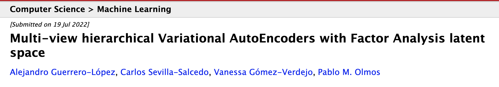
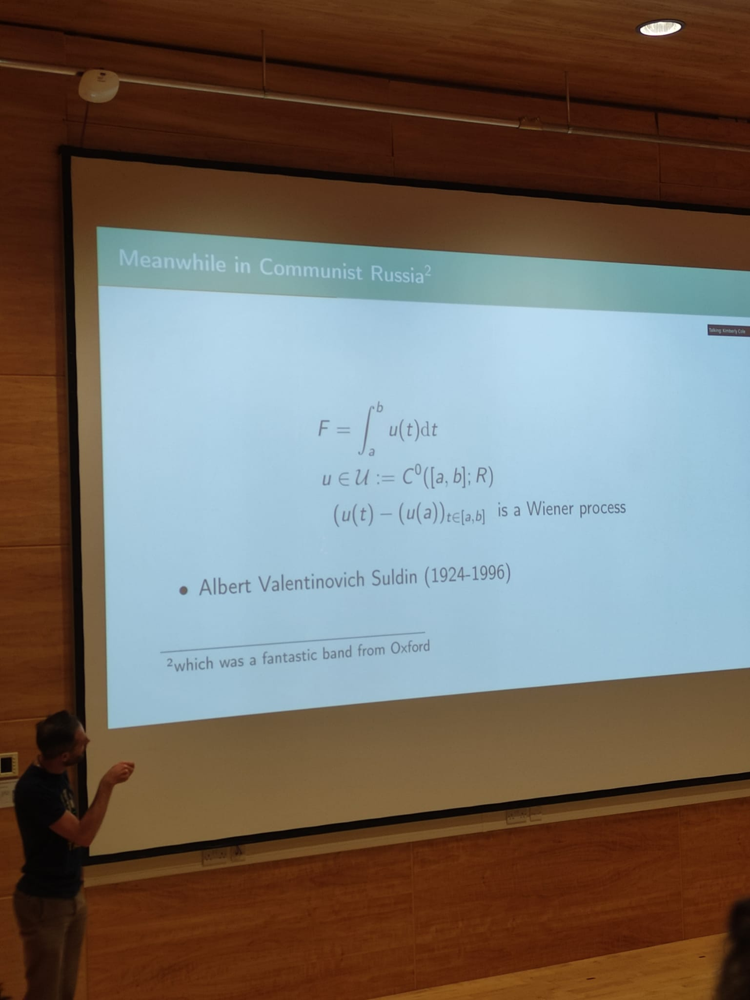
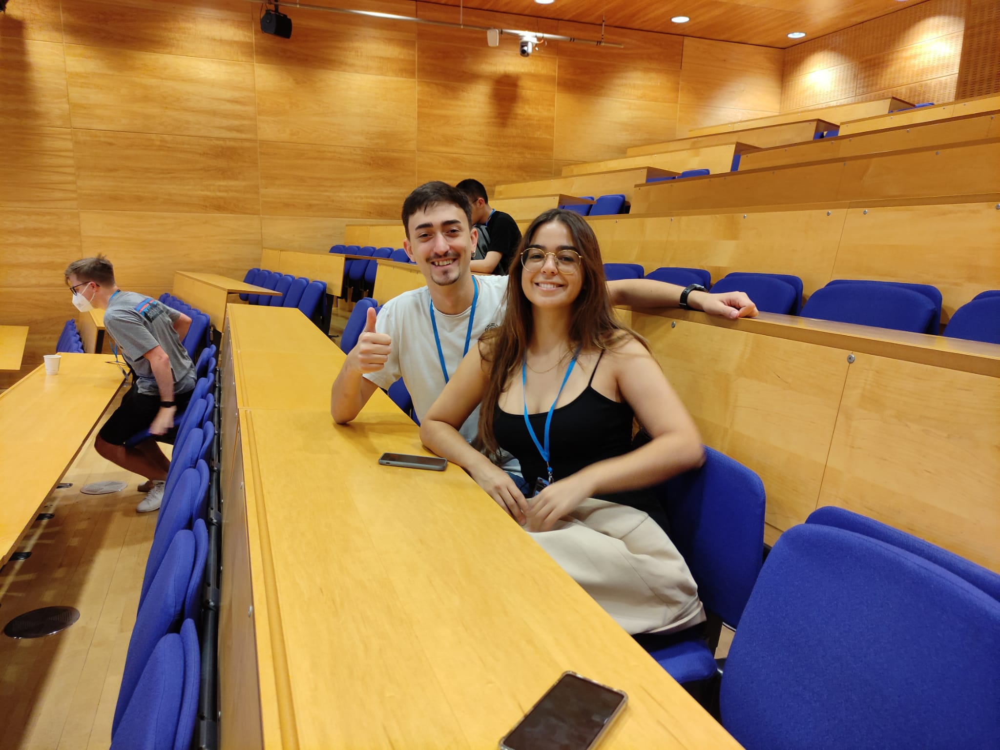
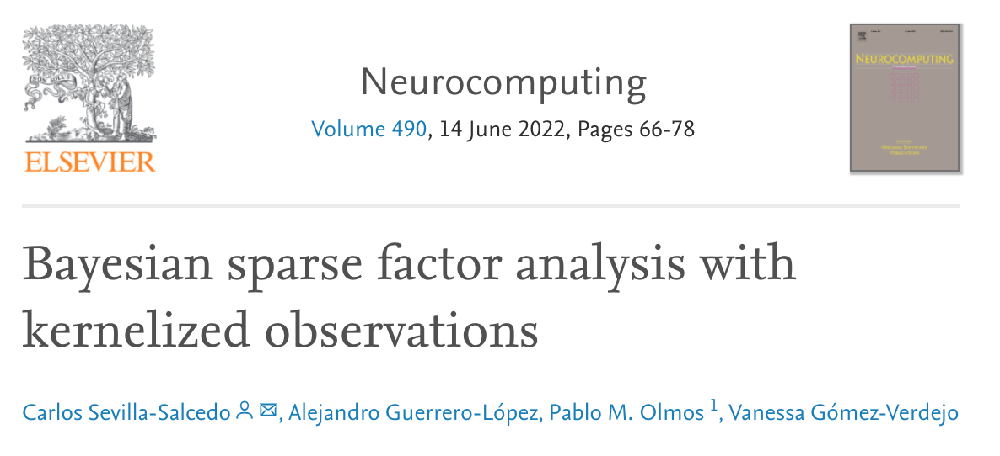

Who I am 
------
Currently, I am a Ph.D. student in Machine Learning for Personalized Medicine at Universidad Carlos III de Madrid (UC3M) under the supervision of [Dr. Pablo M. Olmos](http://www.tsc.uc3m.es/~olmos/) and [Dr. Vanessa Gómez Verdejo](https://vanessa.webs.tsc.uc3m.es). I am also working with [Gregorio Marañón Health Research Institute (IISGM)](https://www.iisgm.com) under the supervision of [Dr. Belén Rodríguez-Sánchez](https://scholar.google.es/citations?user=W9sZbBoAAAAJ&hl=es). 

My work is focused on the development of probabilistic ML models and applying them to biomedical real problems such as the prediction of Antibiotic Resistance mechanisms in different microorganisms. We focus our research on heterogeneous semisupervised models as they can deal with biomedical typical problems such as missing data and heterogeneous modalities of data.

Last news
------
- _July 2022_: *NEW PREPRINT AVAILABLE* Our new preprint [Multi-view hierarchical Variational AutoEncoders with Factor Analysis latent space](https://arxiv.org/abs/2207.09185) is being peer-reviewed at a journal!
  * 

- _July 2022_: I attended [Cambridge Ellis Machine Learning Summer School](http://www.ellis.eng.cam.ac.uk/summerschool/) and I presented two posters!!!
  *  

- _June 2022_: I've presented a poster about ["Discrimination of species within the Enterobacter cloacae complex using machine learning"](https://www.biorxiv.org/content/10.1101/2021.11.02.467040v1.full) at [9ª Jornada de Investigación e Innovación IiSGM](https://www.iisgm.com/9a-jornada-de-investigacion-e-innovacion-los-dias-8-y-9-de-junio-de-2022/)
- _May 2022_: I am teaching [‘Machine Learning Fundamentals’](https://alexjorguer.github.io/teaching/) course at Fundación BBVA, Fundación Carlos III de Madrid.
- _March 2022_: Our paper ["Bayesian Sparse Factor Analysis with Kernelized Observations"](https://www.sciencedirect.com/science/article/abs/pii/S0925231222002946?via%3Dihub) has been published in Neurocomputing!  
  * 

Short Bio
------
* Ph.D. candidate at [Signal Processing Group](http://gts.tsc.uc3m.es), UC3M, and predoc at [IISGM](https://www.iisgm.com), Madrid, Spain.
* M.Sc. in [Information Health Engineering](https://www.uc3m.es/master/information-health-engineering) at UC3M, Madrid, Spain.
* Telecommunication Engineer at [Alcort](https://alcort.net), Mallorca, Spain.
* Research assistant at [UGIVIA](http://ugivia.uib.es), [UIB](https://www.uib.cat), Mallorca, Spain.
* B.Sc. in [Telematics Engineering](https://www.uib.eu/Learn/estudis-de-grau/grau/telematica/GTT2-P/) at [UIB](https://www.uib.cat), Mallorca, Spain.
