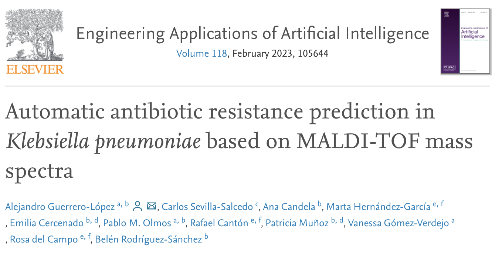
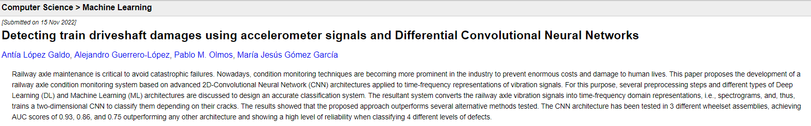

Who am I
------
Currently, I am a Ph.D. candidate at the Universidad Carlos III de Madrid (UC3M) pursuing research in the field of __Machine Learning for Personalised Medicine__. I am under the joint supervision of [Dr. Pablo M. Olmos](http://www.tsc.uc3m.es/~olmos/) and [Dr. Vanessa Gómez-Verdejo](https://vanessa.webs.tsc.uc3m.es). I am affiliated with the [Gregorio Marañón Health Research Institute (IISGM)](https://www.iisgm.com) and work under the guidance of [Dr. Belén Rodríguez-Sánchez](https://scholar.google.es/citations?user=W9sZbBoAAAAJ&hl=es). 

My research endeavors are primarily centered on advancing the field of Machine Learning by developing novel probabilistic models that can be applied to real-world biomedical problems. Specifically, my work focuses on predicting antibiotic resistance mechanisms in various microorganisms using cutting-edge techniques. To tackle the common challenges faced by the biomedical community, such as missing data and heterogeneous modalities of data, we specialize in developing heterogeneous generative models that provide more accurate and reliable predictions. I am also deeply interested in the fields of eXplainable AI (XAI) and ethical AI. As AI technologies continue to shape our society, it is essential to ensure that they are transparent, trustworthy, and aligned with ethical principles. I believe that XAI can help us build more trustworthy and interpretable models, and I am committed to promoting ethical and responsible AI practices in all aspects of my work. 

Last news
------
- __February 2023__: Glad to be a reviewer in [EAAI](https://www.sciencedirect.com/journal/engineering-applications-of-artificial-intelligence)!
- __January 2023__: Glad to be a reviewer in [Clinical Microbiology Infections](https://www.clinicalmicrobiologyandinfection.com)!
- __December 2022__: Glad to be a reviewer in [AISTATS 2023](http://aistats.org/aistats2023/)!!
- __December 2022__: Our work [Automatic antibiotic resistance prediction in Klebsiella pneumoniae based on MALDI-TOF mass spectra](https://authors.elsevier.com/a/1gAq53OWJ91094) has been officialy __published__ at [Engineering Applications of Artificial Intelligence](https://www.sciencedirect.com/journal/engineering-applications-of-artificial-intelligence)!
  * 
- __November 2022__: *NEW PREPRINT!!* Our work [Detecting train driveshaft damages using accelerometer signals and Differential Convolutional Neural Networks](https://arxiv.org/abs/2211.09011) is being peer-reviewed!
  * 

Short Bio
------
* Ph.D. candidate at [Signal Processing Group](http://gts.tsc.uc3m.es), UC3M, and predoc at [Gregorio Marañón Health Research Institute](https://www.iisgm.com), Madrid, Spain.
* M.Sc. in [Information Health Engineering](https://www.uc3m.es/master/information-health-engineering) at UC3M, Madrid, Spain.
* Telecommunication Engineer at [Alcort](https://alcort.net), Mallorca, Spain.
* Research assistant at [UGIVIA](http://ugivia.uib.es), [UIB](https://www.uib.cat), Mallorca, Spain.
* B.Sc. in [Telematics Engineering](https://www.uib.eu/Learn/estudis-de-grau/grau/telematica/GTT2-P/) at [UIB](https://www.uib.cat), Mallorca, Spain.
