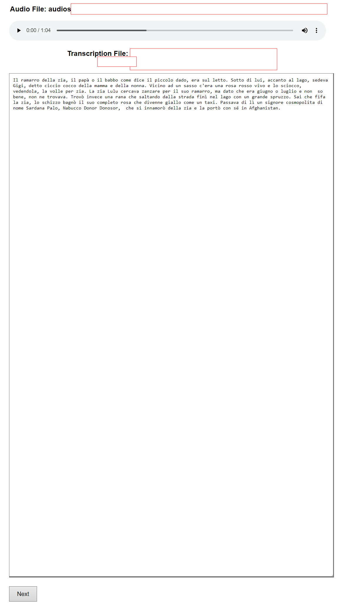

# 🛠️ Manual Transcription Editor

## Overview


## ✨ Features

- **🔊 Audio Playback**: Play audio files directly from your browser with a simple and intuitive interface.
- **✍️ Editable Transcriptions**: Easily edit and save transcriptions in real-time, with changes instantly reflected.
- **📂 Version Control**: Automatically saves old versions of transcriptions with `_oldversion.txt`, ensuring you never lose your original data.

## 🎨 User Interface

The tool features a clean and simple design, making it easy for users to navigate and utilize its functionalities effectively. Below are some screenshots showcasing the interface:

### Main Interface



## 🔧 Installation & Usage

Setting up and using the Manual Transcription Editor is straightforward:

### Installation

1. Clone the repository to your local machine.
2. Place your audio dataset in the `audios` folder. Ensure each `.wav` file has a corresponding `.txt` file with the same name.
3. Run the installation script to set up the environment and dependencies:

    ```bash
    ./install.sh
    ```

### Running the Application

1. Start the application using the following command:

    ```bash
    ./run.sh
    ```

2. Open your web browser and go to `http://127.0.0.1:5000/` to start using the tool.

## 🙏 Acknowledgements

A special thanks to GPT for assisting in programming this project. Am I now a prompt engineer? 😉

## 📜 License

This project is licensed under the MIT License.

---

Thank you for visiting my portfolio. Feel free to explore more of my projects and get in touch if you have any questions or collaboration ideas!

---

[🔙 Back to Portfolio](https://aguerrerolopez.github.io/portfolio/)
